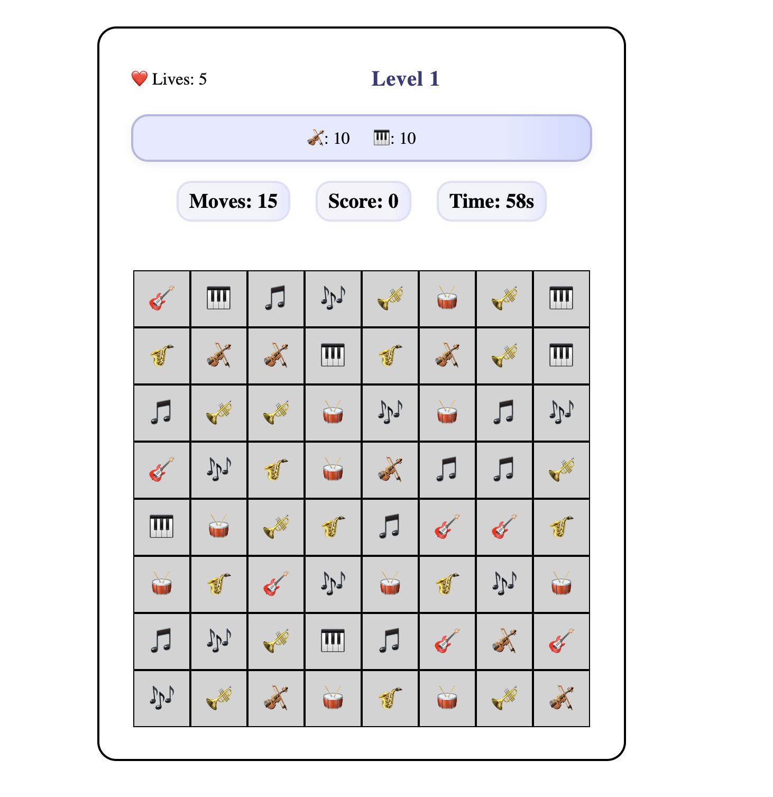

# Musical Match Saga



A musical twist on the classic match-3 formula. Swap and match musical symbols, complete level objectives, and progress through timed challenges with limited moves and lives.

**Solo Project:** This game was designed, developed, and tested entirely by Hannah Olbrich as a personal project. It is not open source and does not accept external contributions.

**Play it here:** https://hannahro15.github.io/Musical-Themed-Candy-Crush/

---

## Table of Contents
1. [Getting Started](#getting-started)
2. [How to Play](#how-to-play)
3. [Features](#features)
4. [Technologies Used](#technologies-used)
5. [Project Structure](#project-structure)
6. [Running Tests](#running-tests)
7. [Test Coverage](#test-coverage)
8. [Known Issues](#known-issues)
9. [Roadmap](#roadmap)
10. [Credits](#credits)

---

## Getting Started

1. Clone the repository:
   ```bash
   git clone https://github.com/hannahro15/Musical-Themed-Candy-Crush.git
   ```
2. Open `index.html` in your web browser.

---

## How to Play

1. Click **Play Game** to start Level 1.  
   - When you start a new game from the menu, your lives are reset to 5.
2. Match 3 or more of the same musical symbols by swapping adjacent tiles.
3. Complete the current level objectives before you run out of moves or time.
4. Track your progress using the in-game HUD, which shows:
   - current level
   - remaining lives
   - objective counters
   - moves, score, and timer
5. If you run out of moves or time, you lose a life.
6. When all lives are lost, you are returned to the menu and can restart with 5 lives.
7. The Play button always starts Level 1 and resets all counters and lives.

Drag or swipe adjacent tiles to create matches:
- Match **3** tiles → 10 points
- Match **4** tiles → 20 points
- Match **5** tiles → 40 points
- Match at least 6 tiles - 60 points

---

## Features

- Musical-themed match-3 gameplay
- Five-life system with automatic reset when starting a new game
- Level progression with different objectives
- Move and timer limits
- Mouse and touch/swipe controls
- Responsive home screen and game HUD
- Modal flows for restart, next level, game over, and congratulations
- Modular JavaScript codebase for easier maintenance and extension
- Jest-based unit and component test coverage across core modules

---

## Technologies Used

- HTML5
- CSS3
- JavaScript (modular ES modules)
- [GitHub Copilot](https://github.com/features/copilot) for AI-assisted development

---

## Project Structure

```
Musical-Themed-Candy-Crush/
│
├── src/
│   ├── board.js
│   ├── boardController.js
│   ├── boardEventHandlers.js
│   ├── constants.js
│   ├── events.js
│   ├── game.js
│   ├── gameState.js
│   ├── gameStatus.js
│   ├── interaction.js
│   ├── levels.js
│   ├── boardController.test.js
│   ├── boardEventHandler.test.js
│   ├── ui.js
│   └── script.js
│
├── __tests__/
│   ├── board.test.js
│   ├── events.test.js
│   ├── game.test.js
│   └── utils.test.js
│   ├── gameStatus.test.js
├── jest.config.js
│   ├── interaction.test.js
│   ├── levels.test.js
│   ├── timer.test.js
│   └── ui.test.js
│
├── index.html
├── styles.css
├── README.md
└── ...
```
## Running Tests
This modular structure makes it easy to maintain, test, and extend the game. Each file is responsible for a specific aspect of the game logic or UI.

---
   npm install
## Running Unit Tests

1. Install dependencies (if not already):
   ```bash
   npm install --save-dev jest
3. Run coverage:
   ```bash
   npx jest --coverage
   ```
2. Run all tests:
   ```bash
   npx jest
   ```
3. Add your test cases in the `__tests__` folder for each module.
This project uses [Jest](https://jestjs.io/) with `babel-jest` and the `jsdom` environment for unit and component testing.
---

## Test Coverage

This project uses [Jest](https://jestjs.io/) for unit and component testing. Test coverage is automatically generated after running the test suite.

- To generate a coverage report, run:
  ```bash
  npx jest --coverage
  ```
- The HTML coverage report can be found at:
  ```
  coverage/lcov-report/index.html
  ```
- Open this file in your browser to view detailed coverage by file and line.

Aim for high coverage, but focus on meaningful tests for game logic, UI, and edge cases. See the coverage report for areas needing more tests.

---

## Known Issues

- Accessibility can still be improved further, especially keyboard support and ARIA labelling.
- The UI is responsive, but further polish and real-device testing would still improve the mobile experience.
- App packaging for Android / Play Store deployment has not yet been completed.

---

## Roadmap

- Improve accessibility: ARIA labels, and contrast checks.
- Continue polishing the UI with improved animation, transitions, and mobile tuning.
- Package the game for mobile using a wrapper such as Capacitor.
- Prepare Play Store assets such as icons, screenshots, and store copy.
- Gather user feedback and iterate on gameplay, feel, and usability.

---


## Credits

Created and maintained by Hannah Olbrich (solo project).
Emoji icons from [Unicode](https://unicode.org/emoji/).
AI-assisted development with GitHub Copilot.


